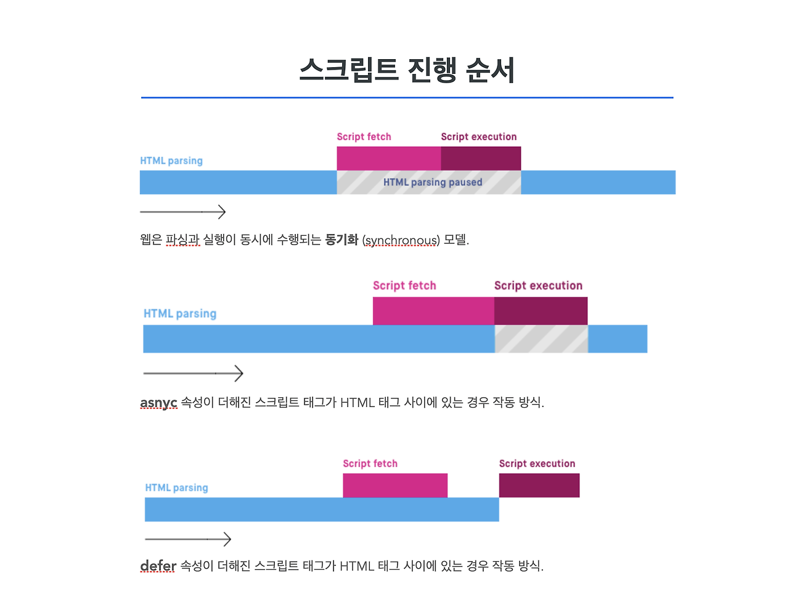
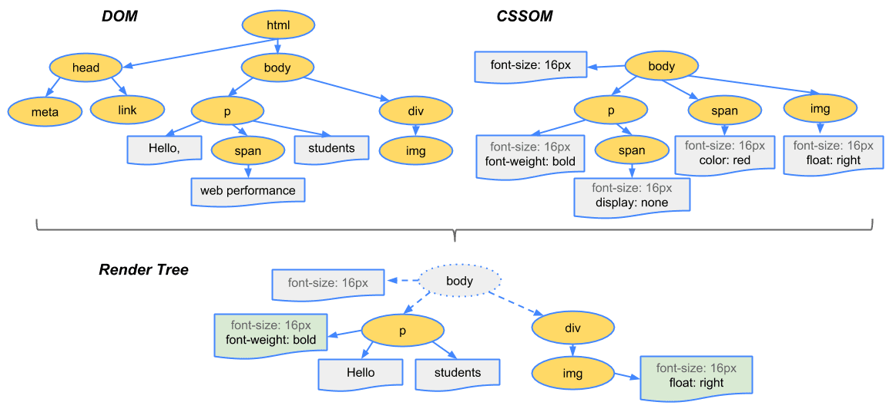

### < 렌더링 >

HTML, CSS, JS 등 개발자가 작성한 문서가 브라우저에서 출력되는 과정

### < 렌더링 엔진 >

\- 브라우저마다 다르지만, 브라우저는 렌더링을 수행하는 렌더링 엔진을 가진다.

예) 크롬 - 블링크 (Blink) / 사파리 - 웹킷 (Webkit) / 파이어폭스 - 게코 (Gecko)

### < CRP (Critical Rendering Path) >

\= 중요 렌더링 경로

\- 브라우저가 HTML, CSS, JS를 화면에 픽셀로 변화하는 일련의 단계

예) DOM (Document Object Model), CSSOM (CSS Object Model), 렌더트리, 레이아웃

### < CRP 최적화 >

**\- 목적:** 가능한 빠르게 웹페이지를 렌더링 하는 것

**방법 1)** CSS, JS의 최소화 및 압축: 파일의 크기를 줄여 빠르게 로딩

**방법 2)** 인라인 CSS와 JS의 사용 최소화: 중요하지 않은 스타일이나 스크립트를 외부 파일로 분리하여 초기 렌더링을 가속화 한다.

**방법 4)** 중요한 CSS를 위쪽에 위치시킨다 → 중요한 컨텐츠를 더 빨리 렌더링해서 전체적인 페이지 로딩 속도가 빨라진다.

**방법 5)** 웹폰트 최적화: 필요한 스타일만 불러오거나 font-display를 사용한다.

### < async, defer >

\- async: HTML 문서 파싱 중 스크립트 로드 후 로드가 완료되면 실행  
\- defer: HTML 문서 파싱 후 스크립트 실행

### < 파싱 >

\- 하나의 프로그램을 런타임 환경 (브라우저 내부의 JS 엔진)에 실제로 실행할 수 있는 내부 포맷으로 분석하고 변환하는 것

\- 문서의 내용을 토큰으로 분석하고 문법적 의미와 구조를 반영한 파스 트리(Parse Tree)를 생성하는 과정

### < DOM (Document Object Model) >

\= 문서 객체 모델

\- HTML로 구성된 웹 페이지와 스크립트 및 프로그래밍 언어를 연결시켜주는 역할

\- 웹페이지를 이루는 태그들을 JS가 이용할 수 있게끔 브라우저가 트리구조로 만든 객체 모델

\- 문서객체: html, head, body와 같은 태그들을 JS가 이용할 수 있는 객체

### < CSSOM (CSS Object Model) >

\- CSS 내용을 파싱하여 자료를 구조화 한 것

\- DOM처럼 CSS내용을 해석하고 노드를 만들어 트리구조로 만든 것

### < 렌더트리 >

\- CSSOM과 DOM 트리의 결합으로 생성

\- 웹 페이지에 나타낼 각 요소들의 위치 (레이아웃)을 계산하는데 사용

\- 픽셀을 화면에 렌더링하는 페인트(Paint), 즉 화면에 요소를 표현하는 프로세스를 위해 존재한다.

### < 레이아웃 >

\= Reflow

\- 뷰포트 내에서 노드의 정확한 위치와 크기를 계산한다.

### < Paint >

\- 노드와 해당 노드의 계산된 스타일 및 기하학적 형태에 대해 파악했으므로 렌더링 트리의 각 노드를 화면의 실제 픽셀로 변환하는 마지막 단계에 이런 정보를 전달한다.

이 과정을 페인팅 또는 래스터화라고 한다.

---

### < 브라우저의 렌더링 원리 >

0\. 사용자가 브러우저를 통해 웹사이트에 접속하면 서버로부터 HTML, CSS 등 웹사이트에 필요한 리소스를 다운받는다.

1\. HTML 파싱 → DOM 트리 구조 구축

2\. CSS 파싱 → CSSOM 트리 구조 구축

3\. JS 실행 \*HTML 중간에 스크립트가 있다면 HTML 파싱이 중단된다.\*

4\. DOM과 CSSOM을 조합하여 렌더트리 구축

5\. Layout 단계: 뷰포트를 기반으로 렌더트리의 각 노드가 가지는 정확한 위치와 크기를 계산한다.

6\. Paint 단계: 계산한 위치/크기를 기반으로 화면에 그린다.

---

### < 참고 자료 >

[https://github.com/Esoolgnah/Frontend-Interview-Questions/blob/main/Notes/important-5/browser-rendering.md](https://github.com/Esoolgnah/Frontend-Interview-Questions/blob/main/Notes/important-5/browser-rendering.md)

[https://web.dev/articles/critical-rendering-path/render-tree-construction?hl=ko](https://web.dev/articles/critical-rendering-path/render-tree-construction?hl=ko)

[https://d2.naver.com/helloworld/59361](https://d2.naver.com/helloworld/59361)
