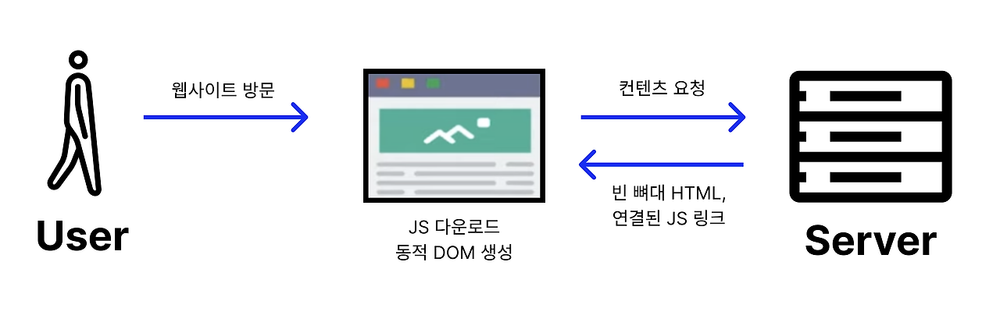
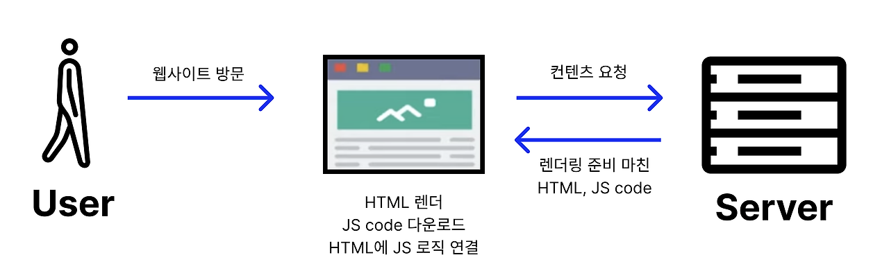

### < SPA >

### Single Page Application

: 하나의 페이지로 구성된 웹 애플리케이션

: 일반적으로 **CSR**로 렌더링

→ 웹 애플리케이션에 필요한 정적 리소스를 한꺼번에 모두 다운로드하고,

새로운 페이지 요청이 왔을 때 필요한 데이터만 전달받아 클라이언트에서 필요한 페이지를 갱신하기 때문

예) 카테고리를 선택하면 헤더는 고정되어 있는 상태로 메인화면 혹은 클릭한 부분만 바뀐다.

### < MPA >

### Multi Page Application

: 탭을 이동할 때마다 서버로부터 새로운 HTML을 새로 받아와서 페이지 전체를 렌더링 하는 전통적인 웹 페이지 구성 방식

: 일반적으로 **SSR**로 렌더링

→ 새로운 페이지 요청이 왔을 때마 이미 렌더링된 정적 리소스를 전달 받아오기 때문

예) 카테고리를 선택하면 새로운 페이지로 이동한다.

---

### < CSR >

### Client Side Rendering

: 최초 로드시 필요한 파일들을 전부 받고, 사용자의 인터렉션에 따라 클라이언트에서 받아와 렌더링을 해주는 방식

→ 기본 틀만 받고, 브라우저에서 동작으로 DOM을 그린다.

\- SSR과 달리 **렌더링이 클라이언트 쪽에서 일어난다.**  
\- 즉, 서버는 요청을 받으면 클라이언트에 HTML과 JS를 보내고 클라이언트는 그것을 받아 렌더링을 시작한다.

1\. User가 Website를 방문하여 브라우저가 서버에 콘텐츠를 요청한다.  
2\. 서버가 CDN을 통해 빈 뼈대만 있는 **HTML 파일과 연결된 JS링크를** 클라이언트로 보낸다.  
\*CDN : 지리적으로 분산된 서버들을 연결한 네트워크.

: 웹 컨텐츠의 복사본을 사용자에 가까운 곳에 두거나 동적 컨텐츠의 전달을 활성화하여 웹 성능 및 속도를 향상 시킨다.

3\. 클라이언트는 **HTML을 다운로드**한다. (이때 SSR과 달리 유저는 아무것도 볼 수 없다.)  
4\. 브라우저가 연결된 JS링크를 통해 서버로부터 JS파일을 다운로드한다.  
5\. JS를 통해 동적으로 페이지를 만들어 브라우저에 띄운다.

\*서버 처리 없이 클라이언트로 보내주기 때문에 JS가 모두 다운로드 되고 실행이 끝나기 전까지 사용자는 볼  
수 있는게 없다.

→ TTV(Time to View)와 TTI(Time to Interact) 간의 시간 간격이 존재하지 않는다.

---

### < SSR >

### Server Side Rendering

: 요청시마다 새로고침이 일어나며 서버에 새로운 페이지에 대한 요청을 하는 방식

→ 이미 다 만들어진 DOM을 받는다.

\- **서버쪽에서 렌더링 준비를 끝마친 상태**로 클라이언트에 전달하는 방식이다.

1\. User가 Website를 방문하여 브라우저가 서버에 콘텐츠를 요청한다.  
2\. 서버는 'Ready to Render'. 즉, CSS까지 모두 적용해 렌더링 준비를 마친 HTML과 JS코드를 브라우저에 응답으로 전달한다.   
3\. 클라이언트에 전달되는 순간, 이미 렌더링 준비가 되어있기 때문에 HTML은 **즉시 렌더링** 된다.
그러나 사이트 자체는 조작 불가능하다. (JS가 읽히기 전이므로)  
4\. 클라이언트가 JS를 다운받는다.  
5\. 다운 받아지고 있는 사이에 유저는 컨텐츠는 볼 수 있지만 사이트를 조작 할 수는 없다. 이때의 사용자 조작을 기억하고 있는다.  
6\. 브라우저가 JS 프레임워크를 실행한다.  
7\. JS까지 성공적으로 컴파일 되었기 때문에 기억하고 있던 사용자 조작이 실행되고 이제 웹 페이지는 상호작용 가능해진다.

\*서버에서 이미 '렌더 가능한' 상태로 클라이언트에 전달되기 때문에, JS가 다운로드 되는 동안 사용자는 무언가를 보고 있을 수 있지만 조작은 불가능하다

→ TTV(Time to View)와 TTI(Time to Interact) 간의 시간 간격이 존재한다.

---

### < SSG >

### Static Site Generation (Static Rendering)

: 서버에서 HTML을 보내준다는 차원에서는 SSR과 유사하지만, '언제' 만들어주는지에 따라 다르다.

\*SSR - 요청 시 서버에서 즉시 HTML을 만들어 응답 → 데이터가 달라지거나 자주 바뀌어서 미리 만들어 두기 어려운 페이지에 적합

\*SSG - 페이지들을 서버에 모두 만들어 둔 후에 요청 시 해당 페이지를 응답 → 바뀔 일이 거의 없어 캐싱해 두면 좋을 페이지에 적합

---

### < CSR과 SSR 차이 >

**1\. 웹페이지를 로딩하는 시간**  
**\- 첫 페이지 로딩시간 ( 초기 로딩 속도: SSR > CSR )**  
**\> CSR**

: HTML, CSS와 모든 스크립트들을 한 번에 불러온다.

: 브라우저가 JS 파일을 다운로드하고, 동적으로 DOM을 생성하는 시간을 기다려야 하기 때문에 초기 로딩 속도가 느리다.

**\> SSR**

: 자바스크립트 코드를 다운로드 받고, 실행하기 전에 사용자가 이미 HTML이 렌더링 된 화면을 볼 수 있어 초기 로딩속도가 빠르다.

**\- 나머지 로딩 시간 ( 평균 속도: SSR < CSR )**  
첫 페이지를 로딩한 후, 사이트의 다른 곳으로 이동하는 식의 동작을 가정.

**\> CSR**

: 이미 첫 페이지 로딩할 때 나머지 부분을 구성하는 코드를 받아왔기 때문에 페이지 일부를 변경할 때는 서버에서 해당 데이터만 요청하면 되기 때문에 이후 구동 속도는 빠르다.

**\> SSR**

: 첫 페이지를 로딩한 과정을 정확하게 다시 실행한다.

**2\. SEO 대응**  
검색 엔진은 자동화된 로봇인 '크롤러'로 웹 사이트들을 읽는다.  웹 크롤러는 HTML을 읽어 검색 가능한 색인을 만들어 낸다.

**\> CSR**

: 웹 크롤러 봇 입장에서는 HTML이 비어 있는 것처럼 보여서 색인할만한 콘텐츠가 존재하지 않아 불리하다.

**\> SSR**

: 애초에 서버에서 컴파일되어 클라이언트로 넘어오기 때문에 크롤러에 대응하기 용이하다.

\* SEO(Search Engine Optimization): 검색 엔진 최적화

웹사이트나 콘텐츠가 구글이나 네이버 같은 검색 엔진에서 더 잘 노출되도록 웹 페이지를 최적화하는 것.

**3\. 서버 자원 사용**

**\> CSR**

**:** 클라이언트에서 JS를 통해 페이지를 구성하기 때문에 초기 로딩에서 서버의 역할이 비교적 작다.

: 서버는 HTML 골격만 제공하고, 대부분의 렌더링 작업을 클라이언트에서 수행하여 서버 부하가 적다.

**\> SSR**

**:** 매번 서버에 요청을 하므로 서버 자원을 더 많이 사용한다.

\*리액트로 구현할 때 발생하는 문제점  
\- renderToStrng은 리액트에서 서버사이드 렌더링을 구현할 때 HTML을 생성하는 메소드다.

페이지 초기 로딩 시 서버에서 컴포넌트를 HTML로 변환해 클라이언트로 전달한다.

\- 이 메소드는 동기적으로 실행되며, 모든 요청을 처리하는 동안 서버의 메인 스레드가 블로킹된다.

즉, renderToString이 실행되는 동안 서버는 멈추게 되어 다른 요청을 처리할 수 없는 상황이 발생할 수 있다.

\*참고 renderToString은 리액트가 버전업이 되면서 클라이언트에서의 렌더링 성능을 개선하였다.

클라이언트 측에서는 비동기적인 방식의 처리가 가능해졌다.

SSR 시에도 서버 부하를 줄이고, 비동기적으로 HTML 스트림을 클라이언트에 전달할 수 있다.

---

### < 적절한 서비스 선택 방법 >

**\> CSR**

\- 유저와 **상호작용**이 많고 고객의 **개인정보 보안**이 중요한 웹사이트

: 대부분이 고객의 개인정보로 이루어진 페이지들이라 **검색 엔진에 노출될 필요는 없다.**

**\> SSR**

\- 홍보나 **상위노출이 필요**하고 누구에게나 **같은 내용**을 보여주며 **업데이트가 빈번해** 데이터가 자주 바뀌는 회사 웹사이트

: 요청 시 만들어서 응답하기 때문

**\> SSG**

\- 홍보나 **상위노출이 필요**하고 누구에게나 **같은 내용**을 보여주며 **업데이트를 거의 안하는** 회사 웹사이트

: 미리 만들어두고 요청 시 바로 응답하기 때문

**\> Universal Rendering (초기 렌더링으로는 SSR + 이후 CSR)**

\- **사용자에 따라 페이지 내용이 달라지지만 상위노출이 되어야 하고** \***빠른 interaction**과 **화면 깜빡임이 없어**야 하는 웹사이트

\*초기 구동속도가 빠른 SSR로 초기 렌더링 후 이후 속도가 빠른 CSR 사용

가능하다면 CSR, SSR의 단점을 보완하고 장점을 살린 Universal Rendering을 사용하면 좋을 듯하다.

---

### < 참고자료 >

[https://www.youtube.com/watch?v=YuqB8D6eCKE](https://www.youtube.com/watch?v=YuqB8D6eCKE)

[https://hahahoho5915.tistory.com/52](https://hahahoho5915.tistory.com/52)
