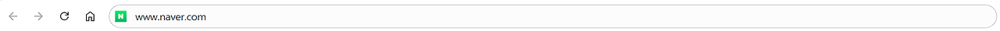
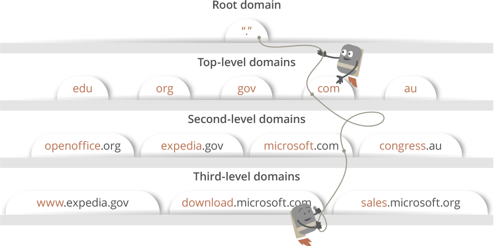
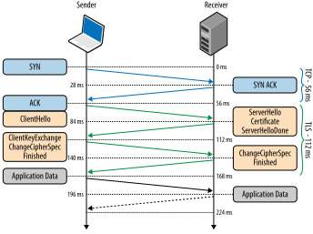
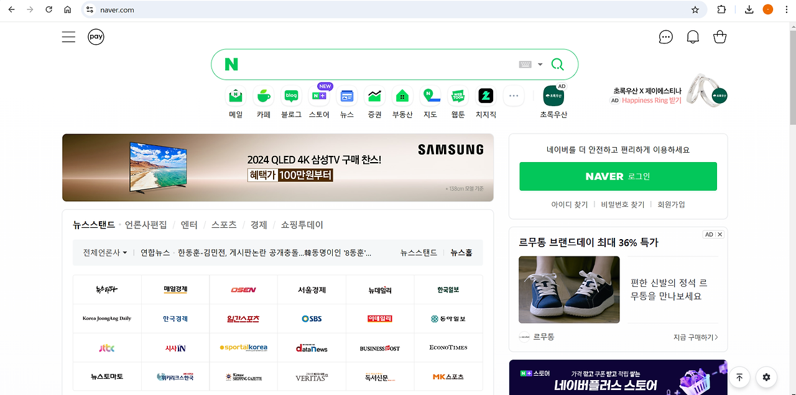

## 요약

1\. URL을 웹 브라우저의 주소창에 입력한다.

- 웹 브라우저가 URL을 해석하고, 문법에 맞지 않으면 기본 검색엔진으로 검색한다.
- 문법에 맞으면 URL의 호스트 부분을 인코딩한다.

2\. HSTS 목록을 확인하고 있으면 HTTPS로, 없으면 HTTP로 요청한다.

3\. DNS(Domain Name Server) 조회 후 해당 도메인에 해당하는 IP를 돌려준다.

- 브라우저/로컬 캐시 확인 → OS 캐시를 확인 → 라우터 캐시 확인 → ISP 캐시 확인

4\. TCP 소켓을 열고 3-way handshake로 연결을 설정한다.

- HTTPS 요청이라면 TLS(Transport Layer Security) handshake 과정을 통해 세션키를 생성한다.

5\. 세션이 유지되는 동안 서버에게 요청하고 응답을 받는 과정을 반복한다.

- 응답 상태코드에 따라 다르게 처리한다.
- 응답을 디코딩(Decoding)하고 캐싱 가능하다면 캐싱한다.

6\. 웹브라우저는 응답받은 HTML/CSS/JS 및 이미지,폰트 등의 리소스를 사용하여 렌더링 한다.

7\. 서버와의 세션이 종료되면 4-way handshake로 연결을 종료한다.

---

### **1. URL을 웹 브라우저의 주소창에 입력한다.**

주소창에 www.naver.com을 입력한다.

### **2\. HSTS 목록을 확인하고 있으면 HTTPS로, 없으면 HTTP로 요청한다.**

**HSTS(HTTP Strict-Transport Security)**

- 웹 사이트가 오직 HTTPS를 통해서만 접근이 가능하다고 선언하여, 보안 연결을 전제로 하는 상호작용을 지시하고 강제하는 보안 정책 메커니즘
- 웹 서버가 모든 클라이언트에 대해 안전하지 않은 HTTP 연결은 거부하고 HTTPS만을 허용한다고 명시하면, 브라우저는 이를 해석하고 적용함으로써 구현된다.

### **3\. DNS(Domain Name Server) 조회 후 해당 도메인에 해당하는 IP를 돌려준다.**

**DNS(Domain Name System)**

- 인터넷 전화번호부
- 웹사이트의 IP 주소와 도메인 주소를 연결해주는 시스템

인터넷의 모든 URL에는 고유한 IP 주소가 할당되어 있으며, IP 주소는 액세스 요청 웹 사이트의 서버를 호스트하는 컴퓨터에 속한다.

DNS의 주요 목적은 쉽게 사이트 주소를 찾을 수 있도록 도와주는 것이다.

DNS가 없다면 google.com과 같이 도메인 주소가 아닌, 142.250.196.110 라는 ip 주소를 외워서 사이트에 접속해야한다.

DNS 가 자동으로 URL과 IP 주소를 매핑해주기 때문에, 쉽게 원하는 사이트에 접속할 수 있다.

DNS 기록을 찾기 위해, 브라우저는 네 개의 캐시를 확인한 후 해당 도메인에 해당하는 IP를 돌려준다.

\*캐싱된 정보가 개인 정보 보호에는 위험할 수 있지만, 캐시는 네트워크 트래픽을 규제하고 데이터 전송 시간을 개선하는 데 필수적 !

1.  **브라우저/로컬 캐시를 확인한다.** 브라우저는 내가 이전에 방문한 웹 사이트의 DNS 기록을 일정 기간 동안 저장하고 있다.
2.  **OS 캐시를 확인한다.** 브라우저 캐시에 원하는 DNS 레코드가 없다면, 브라우저가 내 컴퓨터 OS에 시스템 호출(ex. 윈도우에서 gethostname 호출)을 통해 DNS 기록을 가져온다. (OS도 DNS 레코드 캐시를 저장하고 있다.)
3.  **라우터 캐시를 확인한다.** 만약 컴퓨터에도 원하는 DNS 레코드가 없다면, 라우터에서 DNS 기록을 저장한 캐시를 확인한다.
4.  **ISP 캐시를 확인한다.** 만약 위 모든 단계에서 DNS 기록을 찾지 못한다면, 브라우저는 ISP에서 DNS 기록을 찾는다. ISP(Internet Service Provider)는 DNS 서버를 가지고 있는데, 해당 서버에서 DNS 기록 캐시를 검색할 수 있다.

**\*재귀적 질의(Recursive Query)**

: 필요한 IP 주소를 찾거나, 찾을 수 없다는 오류 응답을 반환할 때까지 한 DNS 서버에서 다른 DNS 서버로 검색이 반복적으로 계속된다.

**\*DNS 서버 - DNS 리커서, 네임 서버**

: 할당된 도메인 영역에 대한 정보를 가지고 있는 서버

주로 도메인을 IP주소로 변환하는 역할을 한다.

**\*DNS 리커서(DNS Recursor)**

: ISP의 DNS 서버

DNS 리커서는 인터넷의 다른 DNS 서버에 답변을 요청하여 의도된 도메인 이름의 적절한 IP 주소를 찾는 일을 담당한다.

**\*네임 서버(Name Server)**

: DNS 리커서가 아닌 다른 DNS 서버

웹사이트 도메인 이름의 도메인 아키텍처를 기반으로 DNS 검색을 수행한다.

\***DNS Lookup**

: DNS 서버에서 인터넷 도메인 이름을 사용해 인터넷 주소 (ip)를 알아내는 과정.

**도메인 아키텍처 구성**

URL은 3차 도메인, 2차 도메인, 최상위 도메인(TLD: Top Level Domain)으로 이뤄진다.

각 단계에는 DNS 룩업(lookup) 도중에 쿼리되는 고유한 네임 서버가 있다.

예) www.naver.com

1\. **DNS 리커서**가 루트 네임 서버(Root Name Server)에 연결한다.

2\. 루트 네임 서버는 리커서를 **.com 도메인 네임 서버**로 리디렉션한다.

3\. .com 네임 서버는 **naver.com 네임 서버**로 리디렉션한다.

4\. naver.com 네임 서버는 DNS 기록에서 www.naver.com과 일치하는 IP 주소를 찾아 **DNS 리커서**로 반환하고, 리커서는 이를 **브라우저**로 다시 보낸다.

위와 같은 요청(Request)은 내용 및 IP 주소(DNS 리커서의 IP 주소)와 같은 정보를 작은 **데이터 패킷**에 담겨 전송된다.

이 패킷은 올바른 DNS 서버에 도달하기 전에 클라이언트와 서버 사이의 여러 **네트워킹 장비**를 통해 이동한다.

이 장비는 **라우팅 테이블**을 사용하여 패킷이 목적지에 도달할 수 있는 가장 빠른 방법을 알아낸다.

만약 이동 도중에 패킷이 손실되면, **요청 실패 오류**가 발생한다.

그렇지 않으면 올바른 DNS 서버에 도달하여 IP 주소를 가져온 후 브라우저로 돌아간다.

### **4\. TCP 소켓을 열고 3-way handshake로 연결을 설정한다.**

브라우저가 올바른 IP 주소를 수신하면 IP 주소와 일치하는 서버와 연결해 정보를 전송한다.

일반적으로 HTTP 요청에서는 TCP(Transmission Control Protocol)를 사용한다.

HTTPS 요청이라면 TLS(Transport Layer Security) handshake를 사용한다.

**TCP 연결**

1.  클라이언트는 인터넷을 통해 서버에 **SYN 패킷**을 보내 새 연결이 가능한지 여부를 묻는다.
2.  서버에 새 연결을 수락할 수 있는 열린 포트가 있는 경우, **SYN/ACK 패킷**을 사용하여 SYN 패킷의 ACK(승인)으로 응답한다.
3.  클라이언트는 서버로부터 SYN/ACK 패킷을 수신하고 **ACK 패킷**을 전송하여 승인한다.

**TLS handshake**

1.  클라이언트에서 서버에 **ClientHello 메시지**를 보낸다. 여기에는 클라이언트에서 사용 가능한 T**LS 버전, 서버 도메인, 세션 식별자, 암호 설정** 등의 정보가 포함된다.
2.  클라이언트의 메시지를 받은 서버는 **ServerHello 메시지**를 클라이언트에게 보낸다. 여기에는 ClientHello 메시지의 정보 중 서버에서 사용하기로 선택한 **TLS 버전, 세션 식별자, 암호 설정** 등의 정보가 포함된다.
3.  서버가 클라이언트에 **Certificate 메시지**를 보낸다. 여기에는 서버의 인증서가 들어간다. 이 인증서는 별도의 인증 기관에서 발급받은 것이며, 서버가 신뢰할 수 있는 자임을 인증한다. 전송이 끝나면 ServerHelloDone 메시지를 보내 끝났음을 알린다.
4.  클라이언트는 서버에서 받은 **인증서를 검증**한다. 인증서를 신뢰할 수 있다고 판단하였다면 다음 단계로 넘어간다.
5.  클라이언트는 임의의 **pre-master secret**을 생성한 뒤, 서버가 보낸 인증서에 포함된 **공개 키를 사용해 암호화**한다. 이렇게 암호화된 **pre-master secret을 ClientKeyExchange 메시지에 포함시켜 서버에 전송**한다.
6.  서버는 전송받은 정보를 **복호화**하여 **pre-master secret을 알아낸 뒤**, 이 정보를 사용해 **master secret을 생성**한다. 그 뒤 **master secret에서 세션 키를 생성**해내며, 이 세션 키는 앞으로 서버와 클라이언트 간의 통신을 **암호화**하는 데 사용될 것이다. 물론 클라이언트 역시 자신이 만들어낸 pre-master secret을 알고 있으므로, 같은 과정을 거쳐 세션 키를 스스로 만들 수 있다.
7.  이제 서버와 클라이언트는 각자 **동일한 세션 키**를 가지고 있으며, 이 키를 사용해 **대칭키 암호**를 사용하는 통신을 할 수 있다. 따라서 우선 서로에게 **ChangeCipherSpec 메시지**를 보내 앞으로의 모든 통신 내용은 세션 키를 사용해 암호화해 보낼 것을 알려준 뒤, **Finished 메시지**를 보내 각자의 핸드셰이킹 과정이 끝났음을 알린다.
8.  이제 서버와 클라이언트 간에 보안 통신이 구성된다.

### **5\. 세션이 유지되는 동안 서버에게 요청하고 응답을 받는 과정을 반복한다.**

**요청**

TCP 연결이 설정되면 데이터 전송이 시작된다.

브라우저는 www.naver.com 웹 페이지를 요청하는 GET 요청을 보낸다.

만약 자격 증명(credentials)을 입력하거나 form을 제출하는 경우 POST 요청을 사용할 수 있다.

**요청에 포함되는 것**

브라우저 식별(User-Agent 헤더), 수락할 요청 유형(Accept 헤더), 추가 요청을 위해 TCP 연결을 유지하라는 연결 헤더와 같은 추가 정보, 브라우저가 이 도메인에 대해 저장한 쿠키에서 가져온 정보

**응답**

서버에는 웹 서버가 포함되어 있는데, 이는 브라우저로부터 요청을 수신하고, 해당 내용을 request handler에 전달하여 응답을 읽고 생성한다. 그런 다음 response를 특정 포맷으로(JSON, XML, HTML)으로 작성한다.

**\*Request handler**

: 요청, 요청의 헤더 및 쿠키를 읽고 필요한 경우 서버의 정보를 업데이트하는 프로그램

NET, PHP, Ruby, ASP 등으로 작성된다.

**서버 응답에 포함되는 것**

요청한 웹 페이지와 함께 상태 코드(status code), 압축 유형(Content-Encoding), 페이지 캐싱 방법(Cache-Control), 설정할 쿠키, 개인 정보

'Status Code' 헤더에 상태 코드가 숫자로 표시된다.

- **1xx (Information Response)**: 정보 메시지만을 나타낸다. 서버가 요청을 받았으며 서버에 연결된 클라이언트는 계속해서 작업을 하라는 뜻.
- **2xx (Successful Response)**: 서버와의 요청이 성공함을 나타냄
- **3xx (Redirection Message)** : 요청 완료를 위해 추가 작업 조치가 필요함을 의미함. 위 사진의 **301(Moved Permantly)**는 요청한 리소스의 URI가 변경 되었음을 뜻한다.
- **4xx (Client Error Response)** : 클라이언트의 Request에 에러가 있음을 의미함.
- **5xx (Server Error)** : 서버 측의 오류로 request를 수행할 수 없음.

### **6\. 웹브라우저는 응답받은 HTML/CSS/JS 및 이미지,폰트 등의 리소스를 사용하여 렌더링 한다.**

1\. HTML 골격을 렌더링한다.

2\. HTML 태그를 확인하고 이미지, CSS 스타일시트, JS 파일 등과 같은 웹 페이지의 추가 요소에 대한 GET 요청을 보낸다.

정적 파일(Static File)은 브라우저에서 캐싱되므로 다음에 페이지를 방문할 때 다시 가져올 필요가 없다.

3\. www.naver.com 페이지가 브라우저에 나타난다.

### **7\. 서버와의 세션이 종료되면 4-way handshake로 연결을 종료한다.**

---

**참조**

[https://namu.wiki/w/TLS](https://namu.wiki/w/TLS)

[https://velog.io/@sejinkim/HTTP-Strict-Transport-Security](https://velog.io/@sejinkim/HTTP-Strict-Transport-Security)

[https://velog.io/@khy226/%EB%B8%8C%EB%9D%BC%EC%9A%B0%EC%A0%80%EC%97%90-url%EC%9D%84-%EC%9E%85%EB%A0%A5%ED%95%98%EB%A9%B4-%EC%96%B4%EB%96%A4%EC%9D%BC%EC%9D%B4-%EB%B2%8C%EC%96%B4%EC%A7%88%EA%B9%8C](https://velog.io/@khy226/%EB%B8%8C%EB%9D%BC%EC%9A%B0%EC%A0%80%EC%97%90-url%EC%9D%84-%EC%9E%85%EB%A0%A5%ED%95%98%EB%A9%B4-%EC%96%B4%EB%96%A4%EC%9D%BC%EC%9D%B4-%EB%B2%8C%EC%96%B4%EC%A7%88%EA%B9%8C)

[https://github.com/baeharam/Must-Know-About-Frontend/blob/main/Notes/network/type-url-process.md](https://github.com/baeharam/Must-Know-About-Frontend/blob/main/Notes/network/type-url-process.md)
